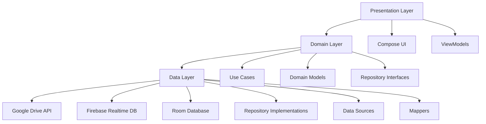

# Android Заметки - Дизайн Приложения

## Обзор

Мобильное Android приложение для создания и управления заметками с функциями совместного использования в реальном времени. Приложение поддерживает два типа заметок (текстовые и чек-листы), цветовое оформление и синхронизацию через Google Drive.

### Ключевые функции:
- Создание текстовых заметок и чек-листов
- Цветовое оформление заметок
- Совместное использование через Google Drive
- Синхронизация в реальном времени
- Отслеживание изменений пользователей

## Технологический стек

### Frontend (Android)
- **Язык**: Kotlin
- **UI Framework**: Jetpack Compose
- **Архитектура**: MVVM + Clean Architecture
- **DI**: Hilt (Dagger)
- **Навигация**: Navigation Compose
- **Локальная БД**: Room Database
- **Сеть**: Retrofit + OkHttp
- **Реактивность**: Coroutines + Flow

### Backend Services
- **Google Drive API**: Хранение файлов заметок
- **Google Sheets API**: Синхронизация метаданных
- **Firebase Realtime Database**: Real-time уведомления

### Интеграции
- Google Drive API v3
- Google Authentication
- Firebase SDK

## Архитектура приложения

### Слои архитектуры



### Структура модулей

```
app/
├── presentation/
│   ├── ui/
│   │   ├── notes/
│   │   ├── editor/
│   │   └── settings/
│   └── viewmodels/
├── domain/
│   ├── entities/
│   ├── usecases/
│   └── repositories/
└── data/
    ├── repositories/
    ├── datasources/
    │   ├── remote/
    │   └── local/
    └── models/
```

## Архитектура компонентов

### Основные экраны

#### 1. Экран списка заметок (NotesListScreen)
```kotlin
@Composable
fun NotesListScreen(
    viewModel: NotesListViewModel,
    onNoteClick: (String) -> Unit,
    onCreateNote: () -> Unit
)
```

**Компоненты:**
- `NoteCard` - карточка заметки с превью
- `FloatingActionButton` - кнопка создания
- `SearchBar` - поиск заметок
- `FilterChips` - фильтры по цвету/типу

#### 2. Экран редактора (NoteEditorScreen)
```kotlin
@Composable
fun NoteEditorScreen(
    noteId: String?,
    viewModel: NoteEditorViewModel,
    onBack: () -> Unit
)
```

**Компоненты:**
- `TextNoteEditor` - редактор текстовых заметок
- `ChecklistEditor` - редактор чек-листов
- `ColorPicker` - выбор цвета
- `CollaborationIndicator` - индикатор активных пользователей

#### 3. Настройки (SettingsScreen)
```kotlin
@Composable
fun SettingsScreen(
    viewModel: SettingsViewModel
)
```

### Модели данных

#### Domain Models
```kotlin
data class Note(
    val id: String,
    val title: String,
    val content: NoteContent,
    val color: NoteColor,
    val createdAt: Long,
    val updatedAt: Long,
    val lastEditedBy: String,
    val isShared: Boolean
)

sealed class NoteContent {
    data class Text(val content: String) : NoteContent()
    data class Checklist(val items: List<ChecklistItem>) : NoteContent()
}

data class ChecklistItem(
    val id: String,
    val text: String,
    val isCompleted: Boolean,
    val order: Int
)

enum class NoteColor {
    DEFAULT, YELLOW, GREEN, BLUE, RED, PURPLE, ORANGE
}
```

## Управление состоянием

### ViewModel для списка заметок
```kotlin
@HiltViewModel
class NotesListViewModel @Inject constructor(
    private val getNotesUseCase: GetNotesUseCase,
    private val deleteNoteUseCase: DeleteNoteUseCase,
    private val syncNotesUseCase: SyncNotesUseCase
) : ViewModel() {
    
    private val _uiState = MutableStateFlow(NotesListUiState())
    val uiState = _uiState.asStateFlow()
    
    fun loadNotes()
    fun deleteNote(noteId: String)
    fun refreshNotes()
}

data class NotesListUiState(
    val notes: List<Note> = emptyList(),
    val isLoading: Boolean = false,
    val error: String? = null,
    val syncStatus: SyncStatus = SyncStatus.SYNCED
)
```

### ViewModel для редактора
```kotlin
@HiltViewModel
class NoteEditorViewModel @Inject constructor(
    private val saveNoteUseCase: SaveNoteUseCase,
    private val getNoteUseCase: GetNoteUseCase,
    private val realTimeCollaborationUseCase: RealTimeCollaborationUseCase
) : ViewModel() {
    
    private val _uiState = MutableStateFlow(NoteEditorUiState())
    val uiState = _uiState.asStateFlow()
    
    fun loadNote(noteId: String)
    fun saveNote()
    fun updateContent(content: String)
    fun changeColor(color: NoteColor)
    fun addChecklistItem()
    fun toggleChecklistItem(itemId: String)
}
```

## Интеграция с Google Drive API

### Структура хранения

```
Google Drive Folder: /Notes App/
├── notes/
│   ├── {noteId}.json          # Содержимое заметки
│   └── metadata.json          # Метаданные всех заметок
└── collaboration/
    ├── active_users.json      # Активные пользователи
    └── changes_log.json       # Лог изменений
```

### Data Source для Google Drive
```kotlin
interface GoogleDriveDataSource {
    suspend fun uploadNote(note: Note): Result<String>
    suspend fun downloadNote(noteId: String): Result<Note>
    suspend fun deleteNote(noteId: String): Result<Unit>
    suspend fun syncNotes(): Result<List<Note>>
    suspend fun getMetadata(): Result<NotesMetadata>
}

@Singleton
class GoogleDriveDataSourceImpl @Inject constructor(
    private val driveService: Drive,
    private val authManager: GoogleAuthManager
) : GoogleDriveDataSource {
    
    override suspend fun uploadNote(note: Note): Result<String> {
        return try {
            val fileContent = Json.encodeToString(note)
            val fileMetadata = File().setName("${note.id}.json")
            val mediaContent = ByteArrayContent("application/json", fileContent.toByteArray())
            
            val file = driveService.files()
                .create(fileMetadata, mediaContent)
                .setFields("id")
                .execute()
                
            Result.success(file.id)
        } catch (e: Exception) {
            Result.failure(e)
        }
    }
}
```

## Синхронизация в реальном времени

### Firebase Realtime Database структура
```json
{
  "notes": {
    "noteId": {
      "lastModified": 1640995200000,
      "modifiedBy": "user@example.com",
      "version": 5
    }
  },
  "activeUsers": {
    "noteId": {
      "user1@example.com": {
        "cursor": 120,
        "lastActive": 1640995200000
      }
    }
  },
  "changes": {
    "noteId": {
      "changeId": {
        "type": "text_edit",
        "position": 100,
        "content": "новый текст",
        "userId": "user@example.com",
        "timestamp": 1640995200000
      }
    }
  }
}
```

### Realtime Collaboration Service
```kotlin
@Singleton
class RealTimeCollaborationService @Inject constructor(
    private val firebaseDatabase: FirebaseDatabase,
    private val authManager: GoogleAuthManager
) {
    
    fun observeNoteChanges(noteId: String): Flow<NoteChange> {
        return callbackFlow {
            val ref = firebaseDatabase.getReference("changes/$noteId")
            val listener = ref.addValueEventListener(object : ValueEventListener {
                override fun onDataChange(snapshot: DataSnapshot) {
                    snapshot.children.forEach { changeSnapshot ->
                        val change = changeSnapshot.getValue<NoteChange>()
                        change?.let { trySend(it) }
                    }
                }
                override fun onCancelled(error: DatabaseError) {
                    close(error.toException())
                }
            })
            
            awaitClose { ref.removeEventListener(listener) }
        }
    }
    
    suspend fun broadcastChange(noteId: String, change: NoteChange) {
        firebaseDatabase.getReference("changes/$noteId")
            .push()
            .setValue(change)
    }
    
    fun observeActiveUsers(noteId: String): Flow<List<ActiveUser>> {
        // Аналогичная реализация для активных пользователей
    }
}
```

## Бизнес-логика (Use Cases)

### Основные Use Cases

#### 1. Получение заметок
```kotlin
@Singleton
class GetNotesUseCase @Inject constructor(
    private val notesRepository: NotesRepository
) {
    suspend operator fun invoke(): Flow<Result<List<Note>>> = 
        notesRepository.getNotes()
}
```

#### 2. Сохранение заметки
```kotlin
@Singleton
class SaveNoteUseCase @Inject constructor(
    private val notesRepository: NotesRepository,
    private val realTimeService: RealTimeCollaborationService
) {
    suspend operator fun invoke(note: Note): Result<Unit> {
        return try {
            // Сохраняем локально
            notesRepository.saveNote(note)
            
            // Загружаем в Google Drive
            notesRepository.uploadToCloud(note)
            
            // Уведомляем о изменении
            realTimeService.broadcastChange(
                note.id, 
                NoteChange.Updated(note.id, System.currentTimeMillis())
            )
            
            Result.success(Unit)
        } catch (e: Exception) {
            Result.failure(e)
        }
    }
}
```

#### 3. Синхронизация заметок
```kotlin
@Singleton
class SyncNotesUseCase @Inject constructor(
    private val notesRepository: NotesRepository,
    private val realTimeService: RealTimeCollaborationService
) {
    suspend operator fun invoke(): Result<Unit> {
        return try {
            // Получаем изменения с сервера
            val cloudNotes = notesRepository.getNotesFromCloud()
            val localNotes = notesRepository.getLocalNotes()
            
            // Разрешаем конфликты
            val mergedNotes = mergeNotes(cloudNotes, localNotes)
            
            // Сохраняем результат
            notesRepository.saveNotes(mergedNotes)
            
            Result.success(Unit)
        } catch (e: Exception) {
            Result.failure(e)
        }
    }
    
    private fun mergeNotes(cloud: List<Note>, local: List<Note>): List<Note> {
        // Логика слияния на основе timestamp
        val merged = mutableMapOf<String, Note>()
        
        (cloud + local).forEach { note ->
            val existing = merged[note.id]
            if (existing == null || note.updatedAt > existing.updatedAt) {
                merged[note.id] = note
            }
        }
        
        return merged.values.toList()
    }
}
```

## Слой данных

### Repository Implementation
```kotlin
@Singleton
class NotesRepositoryImpl @Inject constructor(
    private val localDataSource: NotesLocalDataSource,
    private val remoteDataSource: GoogleDriveDataSource,
    private val realTimeService: RealTimeCollaborationService
) : NotesRepository {
    
    override suspend fun getNotes(): Flow<Result<List<Note>>> = flow {
        try {
            // Сначала локальные данные
            val localNotes = localDataSource.getNotes()
            emit(Result.success(localNotes))
            
            // Затем синхронизация с облаком
            val cloudNotes = remoteDataSource.syncNotes()
            if (cloudNotes.isSuccess) {
                val merged = mergeWithLocal(cloudNotes.getOrThrow(), localNotes)
                localDataSource.saveNotes(merged)
                emit(Result.success(merged))
            }
        } catch (e: Exception) {
            emit(Result.failure(e))
        }
    }
    
    override suspend fun saveNote(note: Note): Result<Unit> {
        return try {
            // Сохраняем локально
            localDataSource.saveNote(note)
            
            // Отправляем в облако
            remoteDataSource.uploadNote(note)
            
            Result.success(Unit)
        } catch (e: Exception) {
            Result.failure(e)
        }
    }
}
```

### Local Data Source (Room)
```kotlin
@Entity(tableName = "notes")
data class NoteEntity(
    @PrimaryKey val id: String,
    val title: String,
    val contentType: String, // "text" или "checklist"
    val content: String, // JSON для checklist
    val color: String,
    val createdAt: Long,
    val updatedAt: Long,
    val lastEditedBy: String,
    val isShared: Boolean,
    val needsSync: Boolean = false
)

@Dao
interface NotesDao {
    @Query("SELECT * FROM notes ORDER BY updatedAt DESC")
    suspend fun getAllNotes(): List<NoteEntity>
    
    @Insert(onConflict = OnConflictStrategy.REPLACE)
    suspend fun insertNote(note: NoteEntity)
    
    @Query("DELETE FROM notes WHERE id = :noteId")
    suspend fun deleteNote(noteId: String)
    
    @Query("SELECT * FROM notes WHERE needsSync = 1")
    suspend fun getNotesNeedingSync(): List<NoteEntity>
}
```

## Тестирование

### Unit Tests

#### ViewModel Tests
```kotlin
@ExperimentalCoroutinesTest
class NotesListViewModelTest {
    
    @get:Rule
    val instantTaskExecutorRule = InstantTaskExecutorRule()
    
    @get:Rule
    val mainDispatcherRule = MainDispatcherRule()
    
    private val mockGetNotesUseCase = mockk<GetNotesUseCase>()
    private val mockDeleteNoteUseCase = mockk<DeleteNoteUseCase>()
    
    private lateinit var viewModel: NotesListViewModel
    
    @Test
    fun `loadNotes should update state with notes`() = runTest {
        // Given
        val notes = listOf(createTestNote())
        every { mockGetNotesUseCase() } returns flowOf(Result.success(notes))
        
        viewModel = NotesListViewModel(mockGetNotesUseCase, mockDeleteNoteUseCase)
        
        // When
        viewModel.loadNotes()
        
        // Then
        assertEquals(notes, viewModel.uiState.value.notes)
        assertFalse(viewModel.uiState.value.isLoading)
    }
}
```

#### Use Case Tests
```kotlin
class SaveNoteUseCaseTest {
    
    private val mockRepository = mockk<NotesRepository>()
    private val mockRealTimeService = mockk<RealTimeCollaborationService>()
    
    private val useCase = SaveNoteUseCase(mockRepository, mockRealTimeService)
    
    @Test
    fun `saveNote should save locally and upload to cloud`() = runTest {
        // Given
        val note = createTestNote()
        coEvery { mockRepository.saveNote(note) } returns Result.success(Unit)
        coEvery { mockRepository.uploadToCloud(note) } returns Result.success(Unit)
        coEvery { mockRealTimeService.broadcastChange(any(), any()) } returns Unit
        
        // When
        val result = useCase(note)
        
        // Then
        assertTrue(result.isSuccess)
        coVerify { mockRepository.saveNote(note) }
        coVerify { mockRepository.uploadToCloud(note) }
    }
}
```

### Integration Tests

#### Repository Tests
```kotlin
@RunWith(AndroidJUnit4::class)
class NotesRepositoryIntegrationTest {
    
    @get:Rule
    val instantTaskExecutorRule = InstantTaskExecutorRule()
    
    private lateinit var database: NotesDatabase
    private lateinit var notesDao: NotesDao
    private lateinit var repository: NotesRepositoryImpl
    
    @Before
    fun setup() {
        database = Room.inMemoryDatabaseBuilder(
            ApplicationProvider.getApplicationContext(),
            NotesDatabase::class.java
        ).allowMainThreadQueries().build()
        
        notesDao = database.notesDao()
        repository = NotesRepositoryImpl(
            NotesLocalDataSourceImpl(notesDao),
            mockk(),
            mockk()
        )
    }
    
    @Test
    fun `saveNote should persist to local database`() = runTest {
        // Given
        val note = createTestNote()
        
        // When
        repository.saveNote(note)
        
        // Then
        val savedNotes = notesDao.getAllNotes()
        assertEquals(1, savedNotes.size)
        assertEquals(note.id, savedNotes[0].id)
    }
}
```